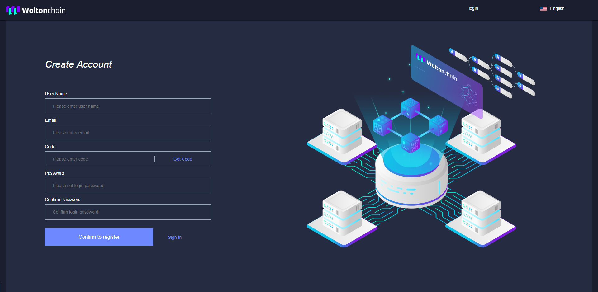
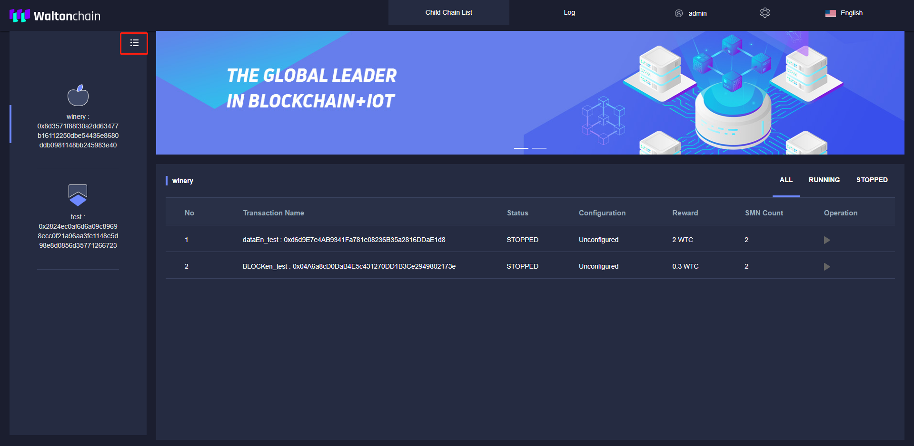
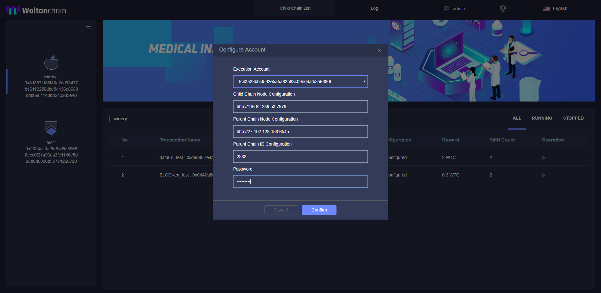
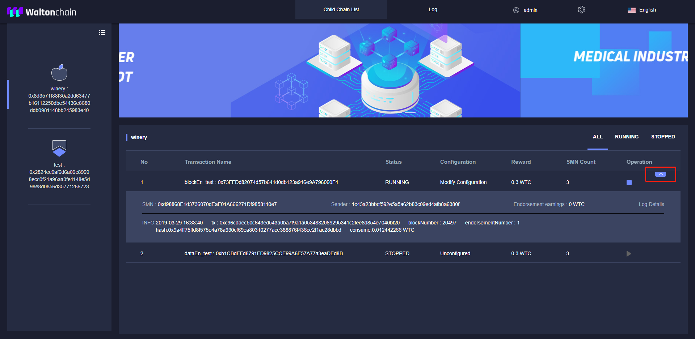
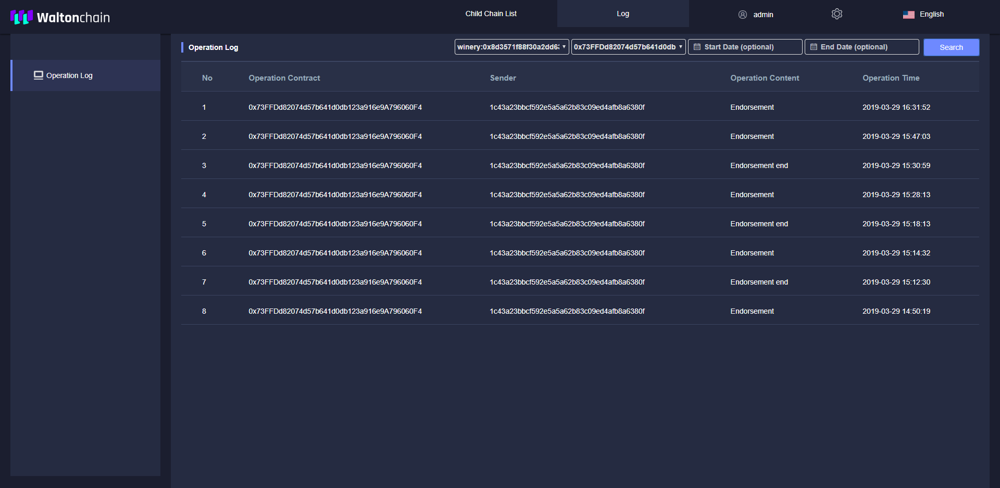
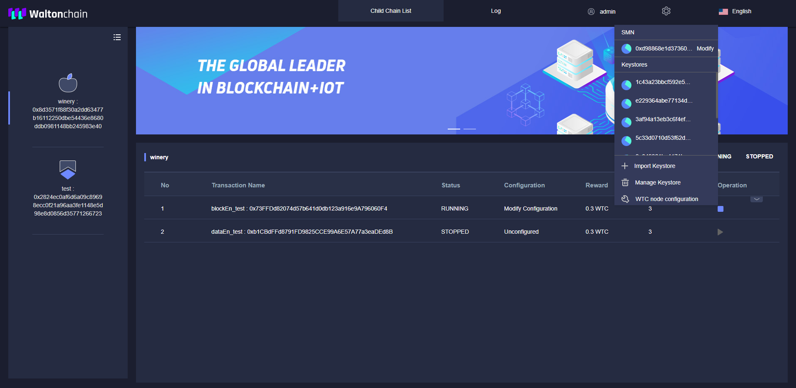
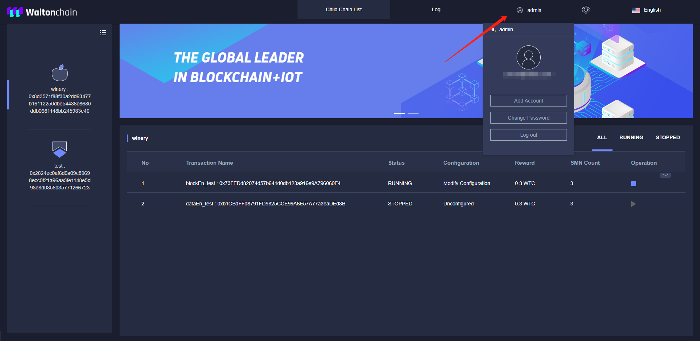
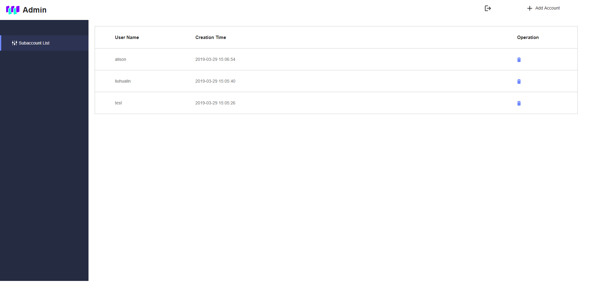

###  Cross-Chain Deployment Manual
#### Description:
- Cross-chain data testing on back end server and front end. After deployment is complete, testing may be performed in the SMN front end.

#### Deployment
##### 1. Back End Deployment:
1.  docker pull baoding/gwtc
1.  docker pull baoding/smn_mongo
1.  docker pull baoding/smn
1. docker run -d -p10101:10101 --name gwtc baoding/gwtc /root/init.sh
1.  docker run -d -v /var/dockerMongodb/db:/data/db -\-name mongo -\-env MONGO_INITDB_DATABASE=smn -\-env MONGO_NON_ROOT_USERNAME=**username** -\-env MONGO_NON_ROOT_PASSWORD=**123456** -\-env MONGO_NON_ROOT_ROLE=dbAdmin baoding/smn_mongo
1. docker run -d -p 3000:3000 -\-name smn -\-link mongo:mongo --link gwtc:gwtc -\-env MONGO_USERNAME=**username** -\-env MONGO_PASSWORD=**123456** baoding/smn
- Bold font is information to be set by user:
- **username**     database username
- **123456**          database password

##### 2. Front End Deployment
1. docker pull baoding/smn_web
1. docker run -d -p 80:80 --name smn_web --link smn:smn baoding/smn_web

#### Instructions:
##### 3. SMN Front End Instructions

1. Open http://xx.xx.xx.xx/dist in browser. xx.xx.xx.xx is server IP.
1. Create an administrator account, log in to the system.

   
   
1. After the first login, you need to configure WTC node and SMN address.
 Reference WTC node: http://gwtc:6545
Reference SMN address: 0xd98868e1d3736070deaf01a666271df9858110e7

1. When the WTC node information and SMN address are configured, the child chains followed by the SMN address are retrieved and displayed in the child chain list on the left panel.

1. Click the icon in the upper right corner of the child chain list to switch the list display method.

1. Cross-chain contracts of the first child chain are displayed by default; contract list is in the middle.

1. When a contract is not configured, its status is ‘STOPPED’, configuration is ‘Unconfigured’ and the operation button is a grey triangle. When you click on the button, the contract configuration input box pops up. Enter the configurations, click ‘Confirm’ (the execution account is subKeyStore address only).
 -Execution Account: account for cross-chain transmission. Please DO NOT use accounts     with big balance e.g. SMN accounts
 -Reference Parent Chain Node Configuration: http://gwtc:6545
 -Reference Parent Chain ID Configuration: 2882
 -Password: execution account password is slk123456
 
1. After successful cross-chain contract configuration, the status will be ‘STOPPED’ and you can see ‘Modify Configuration’ button in the Configuration column. The respective operation button is a blue triangle. Click ‘Modify Configuration’ to reconfigure the cross-chain contract.

1. After a cross-chain contract is successfully started, the status is ‘RUNNING’ and you can see ‘Modify Configuration’ button. The operation button is a blue square. Click it and then click ‘Confirm’ to stop cross-chain transmission.

1. After a cross-chain contract is started, an expand button will appear on the right side of the contract. Click it to view cross-chain log. The log updates every 15 seconds, new records appear at the bottom. Max 6 latest records are displayed.

1. Click one of the child chains on the left panel to view cross-chain contracts under that child chain.

1. Click ‘ALL’ at the top right to view all cross-chain contracts under a child chain. Click ‘RUNNING’ to view the running contracts. Click ‘STOPPED’ to display the configured but not running contracts.

1. Click ‘Log’ on the top navigation bar, select child chain and contract and click ‘Search’ to query operation log of a contract.

1. Click the settings icon on the top navigation bar to see the settings menu.

Click ‘Modify’ in the SMN section of the menu to reconfigure SMN address. After entering the modified SMN address, click ‘Confirm’.

Click ‘Import Keystore’ to add a new keystore.

1. Click the user icon on the top navigation bar for account operations.

Click ‘Add Account’ to add users (only available for administrator accounts).

Click ‘Add Account’ in the top right corner, enter the user name and password of a subaccount and click ’Confirm’ to add the sub account.

